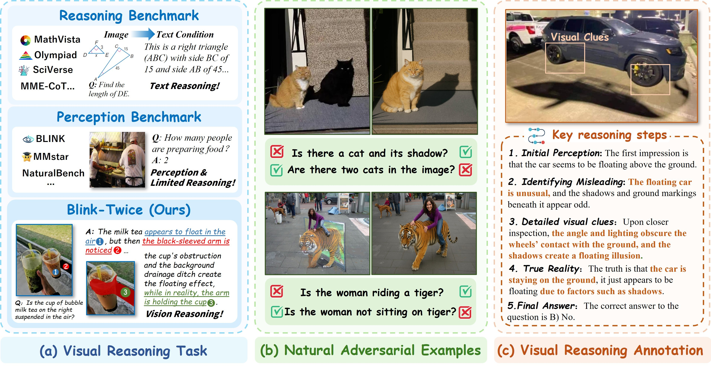
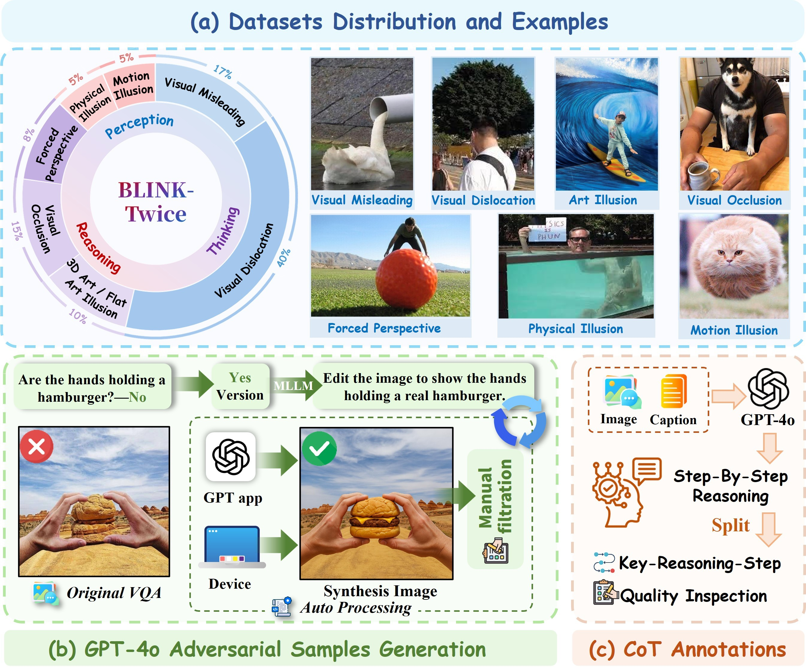

# BLINK-Twice: *You see, but you do not observe.* <br> A Reasoning Benchmark on Visual Perception

[](https://nips.cc/)
[](https://arxiv.org/abs/2510.09361)
[](https://huggingface.co/datasets/PicoTrex/BLINK-Twice)
[](https://creativecommons.org/licenses/by-nc-sa/4.0/)

## 📰 News
* **[2025-10-10]** The paper "BLINK-Twice: You see, but do you observe? A Reasoning Benchmark on Visual Perception" is released on arXiv. 
* **[2025-09-18]** 🎉 Our paper has been accepted by **NeurIPS 2025 Datasets and Benchmarks Track**! 
* **[2025-05-16]** The **BLINK-Twice** dataset is now available. Check out the [HuggingFace Dataset](https://huggingface.co/datasets/PicoTrex/BLINK-Twice).
## 📌 About BLINK-Twice

<p align="center">
  
</p>
<p align="center">
  <strong>BLINK-Twice Task Overview: (a) Visual reasoning tasks requiring detailed observation; (b) Natural adversarial samples with similar appearance but opposite semantics; (c) Reasoning step annotation including detailed visual clues and true reality.</strong>
</p>

Existing Multimodal Large Language Models (MLLMs) have made rapid progress in language-based reasoning but often treat visual input as merely auxiliary context. **BLINK-Twice** is a vision-centric reasoning benchmark designed to bridge this gap. Grounded in the principle *"You see, but you do not observe"* (Sherlock Holmes) , our benchmark shifts the focus from shallow perception to fine-grained observation and analytical reasoning.

As illustrated in the figure above, **BLINK-Twice incorporates three key aspects**:

- **i. Comprehensive Visual Challenges:** Our tasks span **seven carefully curated categories** (e.g., *Visual Dislocation*, *Forced Perspective*, *Motion Illusion*), specifically selected to challenge the perception and reasoning capabilities of current MLLMs.
- **ii. Natural Adversarial Samples:** Leveraging **GPT-4o**'s powerful image editing capabilities, we construct **natural adversarial image pairs**. These pairs are visually similar yet semantically distinct (e.g., holding a cup vs. creating a forced perspective of holding a cup), forcing models to rely on image-grounded evidence rather than language priors.
- **iii. Fine-grained Reasoning Annotations:** We provide **annotated reasoning chains** and **key detail scoring points**. This enables a rigorous evaluation of the reasoning process (Chain-of-Thought) and efficiency, moving beyond simple final answer accuracy.

## 📁 BLINK-Twice Dataset

<p align="center">
  
</p>
<p align="center">
  <strong>Overview of BLINK-Twice Dataset: (a) Distribution and examples of visual challenges; (b) Pipeline for automatic adversarial sample generation; (c) Reasoning chain annotation. </strong>
</p>

The **BLINK-Twice** dataset contains **345 challenging base images** filtered from over 650 initial samples[cite: 118, 119]. To ensure the benchmark truly tests reasoning, we rigorously curated images across **7 types of visual challenges**:

1.  **Visual Misleading:** Errors in object recognition caused by coincidental alignments of color, shape, or composition (e.g., a swan's head mistaken for a water splash).
2.  **Visual Dislocation:** Spatial coincidences between foreground and background elements create positional ambiguity (e.g., foliage appearing as hair).
3.  **Art Illusion:** Flat paintings or landscape art that simulate three-dimensional effects.
4.  **Visual Occlusion:** Partial occlusion leads to identity or structural misjudgment (e.g., a dog blocking a face).
5.  **Forced Perspective:** Manipulated camera angles and depth cues create size distortions (e.g., a giant golf ball).
6.  **Physical Illusion:** Natural physical phenomena such as reflection, refraction, or lighting that distort visual interpretation.
7.  **Motion Illusion:** Static images capturing high-speed movement, creating a false sense of motion (e.g., a floating kitten).

### Statistics
* **Base Images:** 345 high-quality samples.
* **Adversarial Samples:** 103 natural adversarial samples generated via GPT-4o and manual curation.
* **VQA Questions:** 896 manually crafted questions.
* **Reasoning Steps:** 1,725 annotated reasoning steps, emphasizing **detailed visual cues** and **true reality**.

## 📊 Experimental Results

We evaluated 20 leading MLLMs, including foundation models (e.g., GPT-4o, Gemini 1.5 Pro) and reasoning-enhanced models (e.g., o1, Gemini-2.5-Pro). The results demonstrate that **BLINK-Twice** poses a significant challenge, with models often failing to "observe" effectively.

| Model | No-Acc | Yes-Acc | Q-Acc | I-Acc | CoT Score |
| :--- | :---: | :---: | :---: | :---: | :---: |
| **Open-Source MLLMs** | | | | | |
| QVQ-72B | 0.517 | 0.637 | 0.575 | 0.336 | 0.438 |
| Qwen2.5-VL-72B | **0.653** | 0.380 | 0.520 | 0.261 | 0.360 |
| InternVL2-40B | 0.514 | 0.466 | 0.491 | 0.276 | 0.301 |
| **Closed-Source MLLMs** | | | | | |
| **Gemini-2.5-Pro** | **0.729** | **0.600** | **0.667** | **0.470** | 0.584 |
| **GPT-4o** | 0.616 | 0.523 | 0.571 | 0.351 | **0.601** |
| o1 | 0.710 | 0.503 | 0.608 | 0.392 | - |
| Claude-3.7-Thinking | 0.717 | 0.274 | 0.502 | 0.189 | 0.536 |

> **Metrics Key:**
> * **No-Acc / Yes-Acc:** Accuracy on main questions ("No") and adversarial questions ("Yes").
> * **I-Acc (Image Accuracy):** Accuracy where both questions for a single image are correct.
> * **CoT Score:** Evaluates the quality of reasoning chains based on identifying visual cues and inferring reality.

**Key Findings:**
1.  Current MLLMs often "see" but fail to "observe," performing suboptimally on reasoning-heavy tasks.
2.  Chain-of-Thought (CoT) and self-criticism strategies (e.g., QVQ, Claude-3.7-Thinking) significantly improve performance.
3.  Active visual interaction (e.g., OpenAI o3) suggests a new paradigm for vision reasoning.

## 🧪 Evaluate by Yourself

We provide some examples of how to evaluate **BLINK-Twice** on your own.  
Please replace the **API key** and **image path** with your own in:

- `answer-openai.py`
- `answer-qwen.py`

## 🖊️ Citation

If you find this project useful in your research, please cite our paper:

```bibtex
@article{ye2025blink,
  title={BLINK-Twice: You see, but do you observe? A Reasoning Benchmark on Visual Perception},
  author={Ye, Junyan and Jiang, Dongzhi and He, Jun and Zhou, Baichuan and Huang, Zilong and Yan, Zhiyuan and Li, Hongsheng and He, Conghui and Li, Weijia},
  journal={arXiv preprint arXiv:2510.09361},
  year={2025}
}
```
